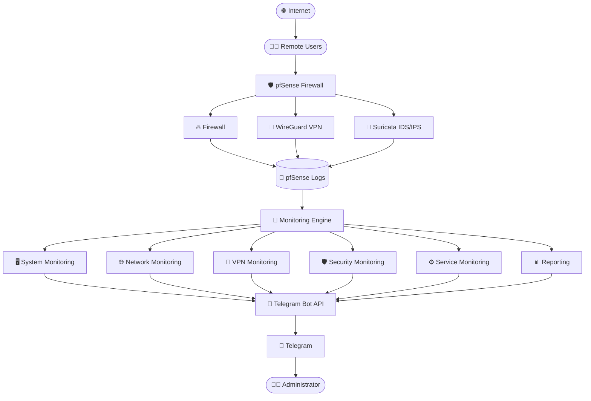
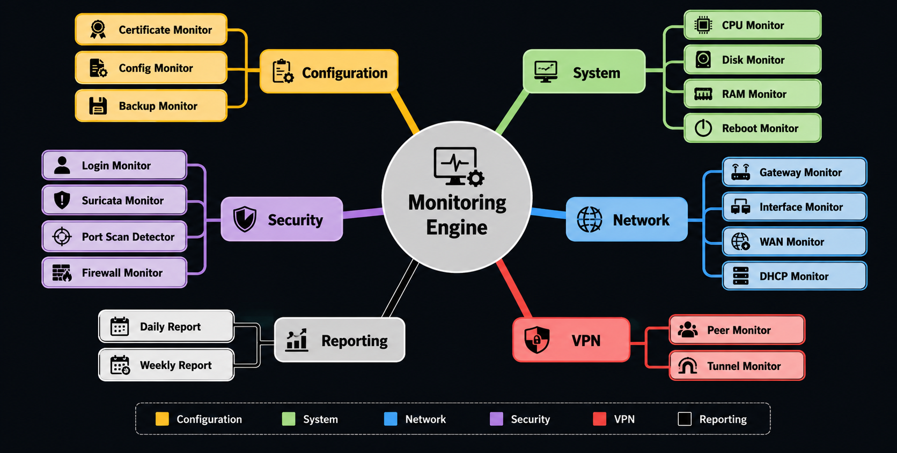

# 🛡️ pfSense Telegram Monitoring Suite

<p align="center">


</p>
---

# Overview

**pfSense Telegram Monitoring Suite** is an open-source monitoring and alerting framework designed for **pfSense firewalls**. It provides real-time security and infrastructure monitoring by sending instant Telegram notifications for critical events such as VPN activity, firewall events, IDS alerts, service failures, configuration changes, interface status, and system health.

Instead of constantly monitoring the pfSense dashboard, administrators receive immediate alerts on Telegram whenever important events occur.

The project is lightweight, modular, and designed to run entirely using native **Shell scripts** and **Cron**, making it suitable for home labs, enterprise environments, educational projects, and SOC demonstrations.

---

#  Features

##  System Monitoring

- CPU Usage Monitoring
- RAM Usage Monitoring
- Disk Usage Monitoring
- System Uptime
- Reboot Detection
- High Resource Usage Alerts

---

##  Network Monitoring

- WAN IP Change Detection
- Internet Connectivity Monitoring
- Gateway Health Monitoring
- High Latency Detection
- Packet Loss Detection
- Interface Up/Down Alerts
- Bandwidth Monitoring

---

##  VPN Monitoring

Supports:

- WireGuard
- OpenVPN (can be extended)

Features

- VPN Tunnel Status
- VPN Peer Connection Alerts
- VPN Peer Disconnection Alerts
- VPN Traffic Statistics

---

##  Firewall Monitoring

- Firewall Block Detection
- Port Scan Detection
- New Device Detection
- DHCP Monitoring
- Interface Status Monitoring

---

## Security Monitoring

- Suricata IDS Alerts
- Successful WebGUI Login Notifications
- Failed WebGUI Login Notifications
- SSH Login Alerts
- Configuration Change Detection
- Firewall Rule Changes
- User Management Monitoring
- Alias Modification Detection

---

##  Service Monitoring

Monitor critical pfSense services including

- WireGuard
- Suricata
- Unbound DNS
- DHCP Server
- SSH
- NTP

Receive alerts whenever a service

- Starts
- Stops
- Restarts

---

##  Maintenance Monitoring

- Automatic Configuration Backup
- Backup Verification
- Certificate Expiry Alerts
- Package Update Notifications
- Daily Health Report
- Weekly Security Report

---

# Telegram Notifications

Example notifications

### VPN Connected

```
🟢 WireGuard VPN Connected

Tunnel : tun_wg0
Peer   : Laptop

Time : 30 Jul 2026 10:42 PM
```

---

### VPN Disconnected

```
🔴 WireGuard VPN Disconnected

Peer : Laptop

Time : 30 Jul 2026 11:15 PM
```

---

### Successful Login

```
🟢 WebGUI Login

User : admin

IP : 192.168.1.20

Time : 10:32 PM
```

---

### Failed Login

```
🔴 Login Failed

Username : admin

IP : 203.18.xxx.xxx

Time : 10:34 PM
```

---

### Suricata Alert

```
🚨 Suricata Alert

ET SCAN Nmap Scan Detected

Source

192.168.1.50

Destination

192.168.1.1
```

---

### WAN Down

```
🔴 Internet Down

Gateway unreachable

Time

22:15
```

---

### Configuration Changed

```
⚙ Configuration Modified

config.xml changed

Please verify changes.

Time

22:44
```

---

#  Project Structure

```
pfSense-Telegram-Monitoring
│
├── README.md
├── LICENSE
├── .gitignore
│
├── config
│   ├── telegram.conf.example
│   ├── cron_jobs.txt
│   └── aliases.conf.example
│
├── scripts
│   ├── system_monitor.sh
│   ├── wan_ip_monitor.sh
│   ├── internet_monitor.sh
│   ├── gateway_health_monitor.sh
│   ├── interface_monitor.sh
│   ├── vpn_monitor.sh
│   ├── vpn_peer_monitor.sh
│   ├── firewall_monitor.sh
│   ├── suricata_monitor.sh
│   ├── webgui_login_monitor.sh
│   ├── ssh_login_monitor.sh
│   ├── new_device_monitor.sh
│   ├── dhcp_monitor.sh
│   ├── config_change_monitor.sh
│   ├── config_backup.sh
│   ├── reboot_monitor.sh
│   ├── service_monitor.sh
│   ├── certificate_monitor.sh
│   ├── package_monitor.sh
│   ├── interface_monitor.sh
│   ├── firewall_rule_monitor.sh
│   ├── alias_monitor.sh
│   ├── bandwidth_monitor.sh
│   ├── portscan_monitor.sh
│   ├── daily_report.sh
│   └── weekly_report.sh
│
├── docs
│   ├── Installation.md
│   ├── Telegram_Setup.md
│   ├── WireGuard_Setup.md
│   ├── Screenshots
│   └── Architecture.png
│
├── images
│   ├── telegram.png
│   ├── dashboard.png
│   └── architecture.png
│
└── logs
```

---

# Architecture


---
## 📂 Monitoring Modules

<p align="center">
  
</p>

The monitoring engine is organized into six functional groups:

- 🖥️ System Monitoring
- 🌐 Network Monitoring
- 🔐 VPN Monitoring
- 🛡️ Security Monitoring
- ⚙️ Configuration Monitoring
- 📊 Reporting

---
---

#  Requirements

- pfSense 2.7+
- Cron Package
- WireGuard Package 
- Suricata Package
- Telegram Bot
- Internet Connection

---

#  Installation

## Clone Repository

```bash
git clone https://github.com/partialHuman/pfSense-Telegram-Monitoring.git
```

---

Copy scripts

```bash
cp scripts/*.sh /root/scripts/
```

---

Make executable

```bash
chmod +x /root/scripts/*.sh
```

---

Create Telegram configuration

```bash
cp config/telegram.conf.example /root/scripts/telegram.conf
```

Edit

```bash
vi telegram.conf
```

```
BOT_TOKEN=xxxxxxxxxxxxxxxx

CHAT_ID=123456789
```

---

Configure Cron

Example

```
* * * * * /root/scripts/system_monitor.sh

* * * * * /root/scripts/vpn_monitor.sh

* * * * * /root/scripts/firewall_monitor.sh
```

---

#  Workflow

```
Firewall Event

      ↓

Log Generated

      ↓

Shell Script

      ↓

Event Analysis

      ↓

Telegram API

      ↓

Instant Notification

      ↓

Administrator
```

---

#  Security

Sensitive files are excluded from Git.

Never upload

- Telegram Token
- Chat ID
- Private Keys
- VPN Keys
- Certificates
- Config Backups

---

#  Screenshots

Include

- Telegram Notifications
- pfSense Dashboard
- WireGuard Configuration
- Suricata Alerts
- Firewall Rules
- Project Architecture

---

#  Use Cases

- Home Lab Monitoring
- Enterprise Firewall Monitoring
- SOC Demonstration
- Cybersecurity Projects
- Network Administration
- Academic Research
- Internship Portfolio
- Final Year Projects

---

#  Technologies Used

- Shell Script
- pfSense
- FreeBSD
- Telegram Bot API
- WireGuard
- Suricata IDS/IPS
- Cron
- OpenSSL
- cURL

---

#  Future Enhancements

- Email Notifications
- Discord Integration
- Slack Integration
- Microsoft Teams Alerts
- REST API
- Grafana Dashboard
- Prometheus Metrics
- AI-based Threat Detection
- Auto Incident Report Generation
- Automatic IP Blocking

---

#  Contributing

Contributions are welcome.

1. Fork the repository

2. Create a feature branch

3. Commit your changes

4. Push to your branch

5. Open a Pull Request

---

#  Support

If you found this project useful,

 Star the repository

 Fork it

 Report issues

 Suggest new features

---

# 📄 License

This project is licensed under the MIT License.

---

#  Author

**Dhrumil Moga**

Cybersecurity Enthusiast | Network Security | pfSense | VLSI | SOC Automation

GitHub: https://github.com/YOUR_USERNAME

LinkedIn: https://linkedin.com/in/YOUR_PROFILE

---
