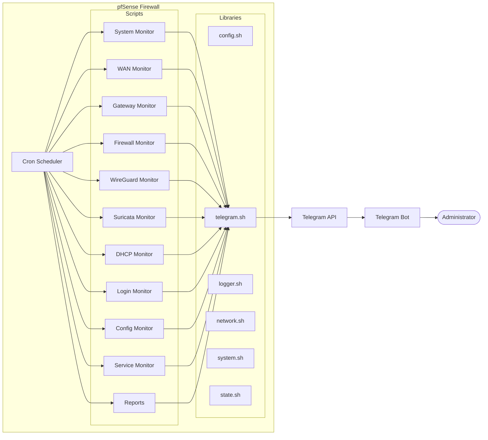

# System Architecture

```mermaid
flowchart LR

    User([Administrator])
    TG[Telegram Bot]
    API[Telegram API]

    subgraph pfSense Firewall

    CRON[Cron Scheduler]

    subgraph Scripts
        SYS[System Monitor]
        WAN[WAN Monitor]
        GW[Gateway Monitor]
        FW[Firewall Monitor]
        WG[WireGuard Monitor]
        SURI[Suricata Monitor]
        DHCP[DHCP Monitor]
        LOGIN[Login Monitor]
        CONF[Config Monitor]
        SERV[Service Monitor]
        REPORT[Reports]
    end

    subgraph Libraries
        CONFIG[config.sh]
        TELEGRAM[telegram.sh]
        LOGGER[logger.sh]
        NETWORK[network.sh]
        SYSTEM[system.sh]
        STATE[state.sh]
    end

    end

    CRON --> SYS
    CRON --> WAN
    CRON --> GW
    CRON --> FW
    CRON --> WG
    CRON --> SURI
    CRON --> DHCP
    CRON --> LOGIN
    CRON --> CONF
    CRON --> SERV
    CRON --> REPORT

    SYS --> TELEGRAM
    WAN --> TELEGRAM
    GW --> TELEGRAM
    FW --> TELEGRAM
    WG --> TELEGRAM
    SURI --> TELEGRAM
    DHCP --> TELEGRAM
    LOGIN --> TELEGRAM
    CONF --> TELEGRAM
    SERV --> TELEGRAM
    REPORT --> TELEGRAM

    TELEGRAM --> API
    API --> TG
    TG --> User
```
