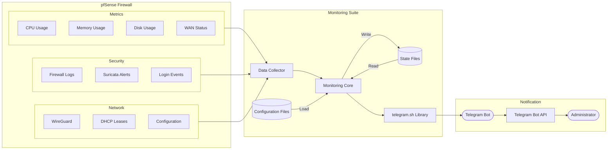

# Data Flow Diagram

This diagram illustrates how monitoring data flows through the pfSense Telegram Monitoring Suite—from data collection to Telegram notifications and persistent state management.

