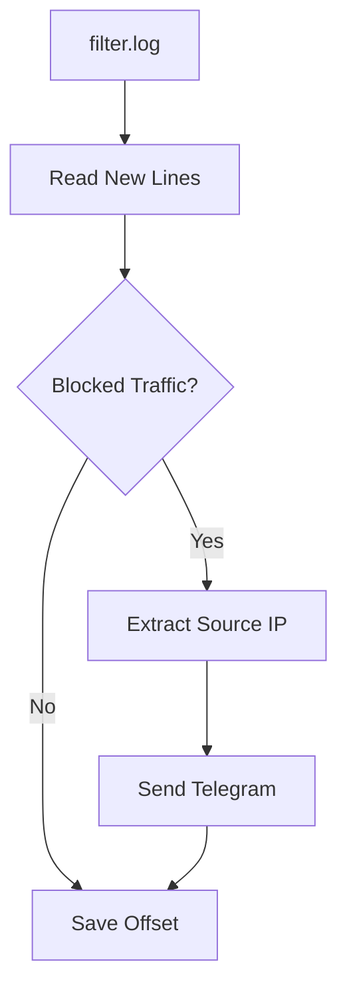

# Firewall Monitoring

```mermaid
flowchart TD

FilterLog[filter.log]

ReadLog[Read New Lines]

Blocked{Blocked Traffic?}

Extract[Extract Source IP]

Notify[Send Telegram]

Save[Save Offset]

FilterLog --> ReadLog

ReadLog --> Blocked

Blocked -- No --> Save

Blocked -- Yes --> Extract

Extract --> Notify

Notify --> Save
```
