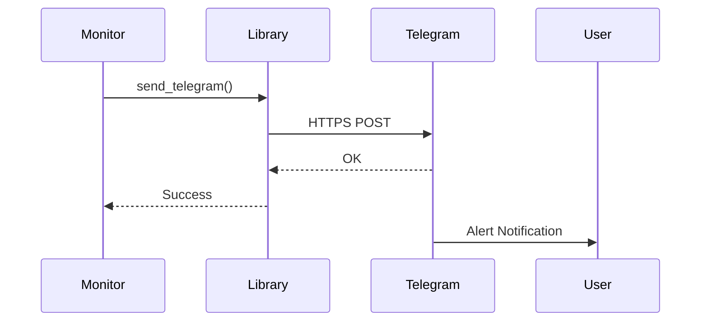

# Telegram Notification Flow

```mermaid
sequenceDiagram

participant Monitor

participant Library

participant Telegram

participant User

Monitor->>Library: send_telegram()

Library->>Telegram: HTTPS POST

Telegram-->>Library: OK

Library-->>Monitor: Success

Telegram->>User: Alert Notification
```
