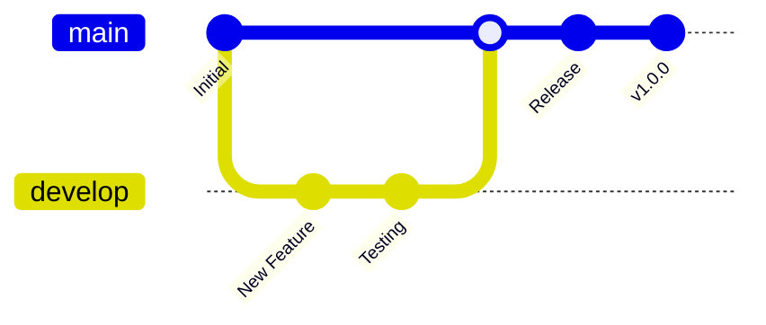

```mermaid
gitGraph

commit id: "Initial"

branch develop

checkout develop

commit id: "New Feature"

commit id: "Testing"

checkout main

merge develop

commit id: "Release"

commit id: "v1.0.0"

```