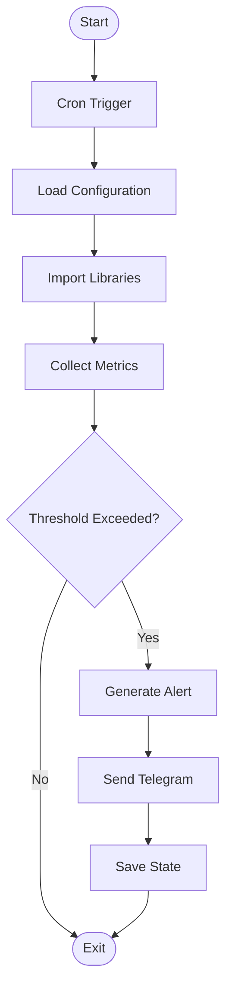

# Script Execution

```mermaid
flowchart TD

Start([Start])

Cron[Cron Trigger]

Load[Load Configuration]

Import[Import Libraries]

Collect[Collect Metrics]

Compare{Threshold Exceeded?}

Alert[Generate Alert]

Telegram[Send Telegram]

Save[Save State]

Exit([Exit])

Start --> Cron

Cron --> Load

Load --> Import

Import --> Collect

Collect --> Compare

Compare -- No --> Exit

Compare -- Yes --> Alert

Alert --> Telegram

Telegram --> Save

Save --> Exit
```
