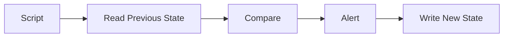

# State Management

```mermaid
flowchart LR

Script

ReadState[Read Previous State]

Compare

WriteState[Write New State]

Alert

Script --> ReadState

ReadState --> Compare

Compare --> Alert

Alert --> WriteState
```
