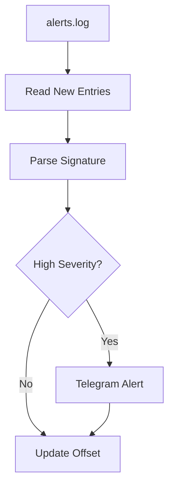

# Suricata Monitoring

```mermaid
flowchart TD

Alerts[alerts.log]

Read[Read New Entries]

Parse[Parse Signature]

Severity{High Severity?}

Alert[Telegram Alert]

Store[Update Offset]

Alerts --> Read

Read --> Parse

Parse --> Severity

Severity -- Yes --> Alert

Severity -- No --> Store

Alert --> Store
```
