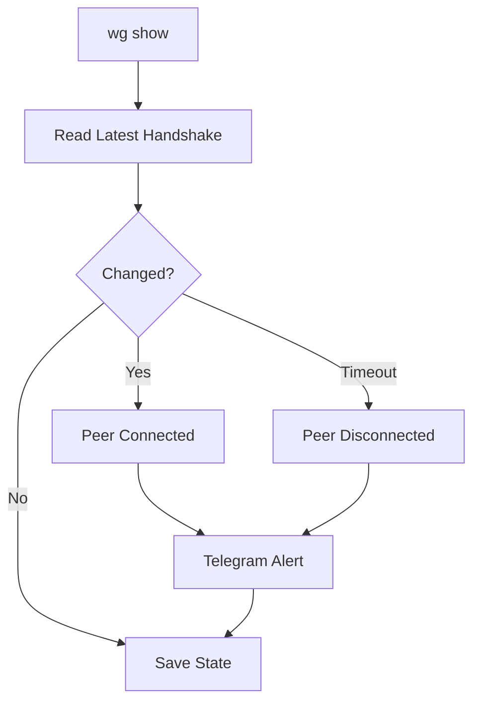

# WireGuard Monitoring

```mermaid
flowchart TD

WG[wg show]

Handshake[Read Latest Handshake]

Compare{Changed?}

Connected[Peer Connected]

Disconnected[Peer Disconnected]

Telegram[Telegram Alert]

State[Save State]

WG --> Handshake

Handshake --> Compare

Compare -- No --> State

Compare -- Yes --> Connected

Compare -- Timeout --> Disconnected

Connected --> Telegram

Disconnected --> Telegram

Telegram --> State
```
