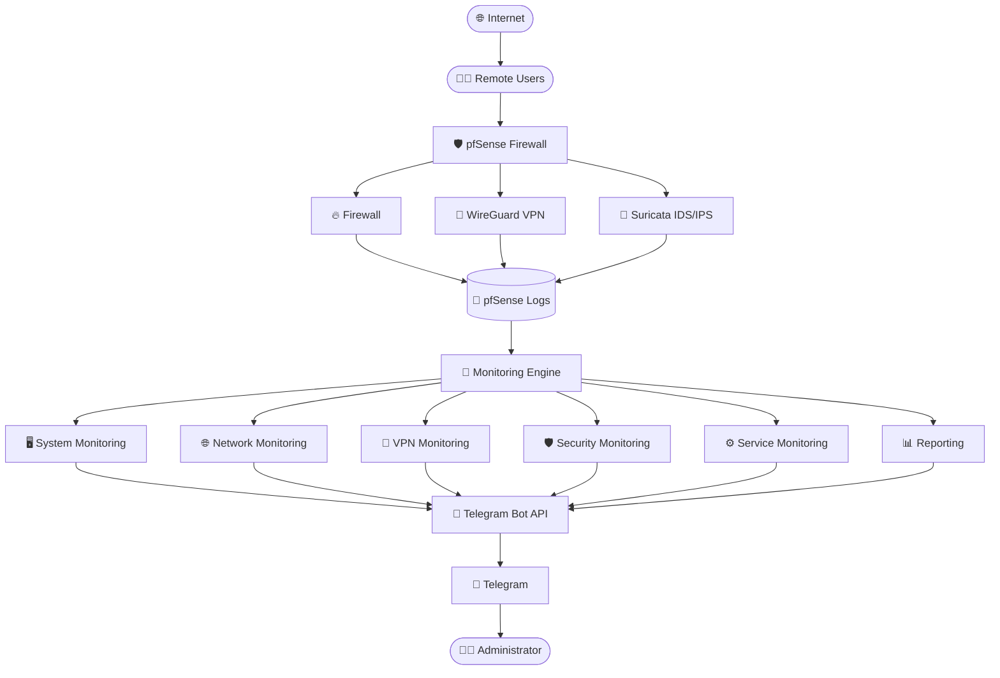

# Project Architecture

This document describes the architecture of the **pfSense Telegram Monitoring Suite**, including its directory structure, execution flow, monitoring modules, shared libraries, configuration management, and notification workflow.

---

# Overview

The **pfSense Telegram Monitoring Suite** is a lightweight, modular monitoring framework written entirely in Shell Script for **pfSense**.

Each monitoring module performs a specific task (such as checking VPN status, monitoring firewall logs, or tracking system resources) and sends real-time Telegram notifications when significant events are detected.

The project is designed around four key principles:

- **Modular**
- **Lightweight**
- **Easy to Extend**
- **Easy to Maintain**

---

# High-Level Architecture



---

# Repository Structure

```
pfSense-Telegram-Monitoring-Suite/
│
├── .github/
├── config/
├── docs/
├── diagram/
├── images/
├── lib/
├── scripts/
├── README.md
├── LICENSE
├── CHANGELOG.md
├── CONTRIBUTING.md
├── SECURITY.md
├── requirements.md
└── .gitignore
```

---

# Directory Responsibilities

## scripts/

Contains all monitoring modules.

Example

```
system_monitor.sh

vpn_monitor.sh

firewall_monitor.sh

suricata_monitor.sh

service_monitor.sh
```

Each script performs one specific task.

---

## config/

Contains configuration files.

Example

```
telegram.conf

monitoring.conf

thresholds.conf

services.conf

notification.conf
```

No secrets should be committed.

---

## lib/

Contains reusable libraries.

Example

```
telegram.sh

common.sh

network.sh

system.sh

logger.sh

state.sh
```

Every monitoring script imports these libraries.

---

## state/

Stores runtime state information.

Example

```
vpn_status

service_status

known_devices

config_hash

firewall_offset
```

These files prevent duplicate Telegram notifications.

---

## reports/

Stores generated reports.

Examples

```
daily_report.txt

weekly_report.txt
```

---

## logs/

Optional local log files generated by scripts.

---

# Monitoring Workflow

Each monitoring module follows the same workflow.

```
Cron

↓

Execute Script

↓

Load Configuration

↓

Read System Information

↓

Compare Previous State

↓

Event Detected?

↓

Yes

↓

Telegram Notification

↓

Save New State

↓

Exit
```

---

# Script Execution Flow

```
Cron

↓

system_monitor.sh

↓

Load Libraries

↓

Load Configuration

↓

Collect Metrics

↓

Compare Thresholds

↓

Alert Required?

↓

Telegram

↓

Update State File
```

---

# Telegram Notification Flow

```
System Event

↓

Monitoring Script

↓

telegram.sh

↓

Telegram API

↓

Telegram Server

↓

Administrator
```

---

# Configuration Flow

Every monitoring script loads configuration before execution.

```
config.sh

↓

telegram.conf

↓

monitoring.conf

↓

thresholds.conf

↓

services.conf

↓

notification.conf
```

This allows all scripts to share the same configuration.

---

# Library Architecture

```
common.sh

├── timestamp()
├── separator()

logger.sh

├── log_info()
├── log_warning()
└── log_error()

telegram.sh

└── send_telegram()

state.sh

├── get_state()
└── save_state()

network.sh

├── internet_up()
├── get_wan_ip()
└── interface_up()

system.sh

├── cpu_usage()
├── memory_usage()
├── disk_usage()
└── uptime()
```

Shared libraries eliminate duplicated code across monitoring modules.

---

# State Management

State files are used to suppress duplicate notifications.

Example

```
Current VPN Status

↓

Read Previous Status

↓

Changed?

↓

YES

↓

Send Telegram Alert

↓

Save New Status
```

Example state files

```
vpn_status

config_hash

known_devices

service_status

firewall_offset
```

---

# Monitoring Modules

The monitoring suite includes the following modules.

| Category | Scripts |
|----------|----------|
| System | CPU, RAM, Disk |
| Network | WAN, Internet, Gateway |
| VPN | Tunnel, Peers |
| Firewall | Blocks, Rules |
| IDS | Suricata |
| Services | DNS, SSH, DHCP |
| Security | Login Monitoring |
| Reports | Daily, Weekly |

---

# Data Sources

The scripts read data from:

| Source | Example |
|---------|---------|
| System Logs | `/var/log/system.log` |
| Firewall Logs | `/var/log/filter.log` |
| Suricata Logs | `/var/log/suricata/*/alerts.log` |
| DHCP Database | `/var/dhcpd/var/db/dhcpd.leases` |
| Configuration | `/cf/conf/config.xml` |
| Network Interfaces | `ifconfig` |
| WireGuard | `wg show` |

---

# Notification Categories

Supported notification types

- System Alerts
- Firewall Alerts
- VPN Alerts
- IDS Alerts
- Login Alerts
- DHCP Alerts
- Configuration Alerts
- Certificate Alerts
- Package Alerts
- Daily Reports
- Weekly Reports

---

# Design Principles

The project is designed with the following goals:

### Modularity

Each monitoring feature is implemented as an independent script.

### Reusability

Shared functions are placed in the `lib/` directory.

### Maintainability

Configuration is centralized in the `config/` directory.

### Scalability

New monitoring modules can be added without modifying existing modules.

### Reliability

State files prevent duplicate alerts and reduce unnecessary notifications.

---

# Performance Considerations

The monitoring suite is designed to have minimal impact on the firewall.

Typical resource usage

| Resource | Usage |
|----------|-------|
| CPU | <2% |
| Memory | <50 MB |
| Storage | Minimal |
| Network | HTTPS requests only |

---

# Security Architecture

Sensitive information is stored separately from source code.

```
config/

↓

telegram.conf

↓

Ignored by Git
```

The repository never includes:

- Telegram Bot Tokens
- Chat IDs
- VPN Private Keys
- Certificates
- Configuration Backups

---

# Extending the Project

Adding a new monitoring module involves:

1. Create a script in `scripts/`.
2. Reuse functions from `lib/`.
3. Add configuration options if required.
4. Schedule the script using Cron.
5. Update the documentation.

This modular design keeps the project organized and easy to maintain.

---

# Architecture Summary

The **pfSense Telegram Monitoring Suite** follows a modular architecture where independent monitoring scripts collect data from pfSense, use shared libraries for common functionality, compare results against configurable thresholds and previous state, and send notifications through the Telegram Bot API.

This architecture makes the project lightweight, scalable, maintainable, and suitable for home labs, enterprise deployments, educational use, and cybersecurity demonstrations.