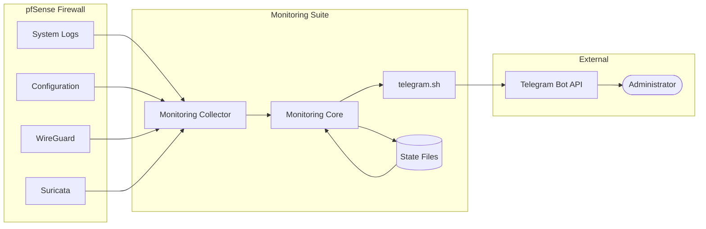

# Security Architecture

This document describes the security architecture of the **pfSense Telegram Monitoring Suite**, including its trust boundaries, data flow, credential management, threat model, and security best practices.

---

# Table of Contents

1. Security Objectives
2. System Architecture
3. Trust Boundaries
4. Threat Model
5. Credential Management
6. Configuration Security
7. Telegram Security
8. WireGuard Security
9. Logging & Audit
10. State File Protection
11. Secure Coding Practices
12. Security Recommendations

---

# Security Objectives

The monitoring suite is designed to:

- Preserve confidentiality of sensitive information.
- Maintain integrity of monitoring data.
- Ensure availability of monitoring services.
- Prevent unauthorized access.
- Minimize system resource usage.
- Protect secrets such as API tokens and VPN keys.

---

# Security Architecture



---

# Trust Boundaries

## Trusted

- pfSense Operating System
- Monitoring Scripts
- Shared Libraries
- Configuration Files
- State Files

---

## Semi-Trusted

- Telegram API
- Internet Connection

---

## Untrusted

- External Attackers
- Unknown Network Clients
- Internet Traffic
- Malicious Log Entries

---

# Threat Model

| Threat | Mitigation |
|---------|------------|
| Credential Leakage | Restrict file permissions |
| Duplicate Alerts | State file comparison |
| Log Injection | Input validation |
| Unauthorized Access | Least-privilege execution |
| Configuration Tampering | SHA256 integrity checks |
| Notification Flooding | Alert deduplication |

---

# Credential Management

Sensitive information includes:

- Telegram Bot Token
- Telegram Chat ID
- WireGuard Private Keys
- VPN Configuration
- SSH Keys

## Best Practices

- Store secrets outside version control.
- Use `.example` configuration files.
- Restrict permissions (`chmod 600`) on sensitive files.
- Rotate credentials if exposure is suspected.

---

# Configuration Security

Configuration files should:

- Be owned by `root`.
- Have read/write permissions only for administrators.
- Exclude secrets from the repository.
- Be backed up before modification.

Example:

```bash
chmod 600 config/telegram.conf
chown root:wheel config/telegram.conf
```

---

# Telegram Security

Recommendations:

- Create a dedicated bot for monitoring.
- Limit the bot to trusted chats or groups.
- Avoid posting alerts to public channels.
- Never commit the bot token to Git.

---

# WireGuard Security

Protect:

- Private keys
- Peer configurations
- Tunnel addresses

Recommendations:

- Restrict access to WireGuard configuration files.
- Rotate keys periodically.
- Monitor handshake failures.
- Alert on unexpected tunnel status changes.

---

# Logging & Audit

Logs should:

- Exclude sensitive credentials.
- Include timestamps.
- Record monitoring events.
- Record notification failures.

Example log entry:

```text
2026-07-31 09:15:22 INFO System Monitor: CPU threshold exceeded (92%)
```

---

# State File Protection

State files are used to prevent duplicate notifications.

Recommendations:

- Store under a protected directory.
- Validate file contents before use.
- Clean up obsolete state files periodically.

---

# Secure Coding Practices

The project follows these practices:

- Quote shell variables.
- Validate command output.
- Check return codes.
- Avoid hardcoded paths where possible.
- Reuse shared libraries.
- Handle errors gracefully.
- Use ShellCheck during development.

---

# File Permissions

| File | Recommended Permissions |
|------|-------------------------|
| Configuration Files | 600 |
| State Files | 600 |
| Log Files | 640 |
| Scripts | 755 |
| Shared Libraries | 644 |

---

# Security Recommendations

- Keep pfSense updated.
- Update WireGuard and Suricata packages regularly.
- Use strong administrator passwords.
- Enable two-factor authentication for pfSense WebGUI.
- Restrict SSH access to trusted hosts.
- Review firewall rules periodically.
- Monitor for repeated authentication failures.
- Back up configuration before major changes.

---

# Incident Response

If a compromise is suspected:

1. Disable Telegram notifications if credentials are exposed.
2. Rotate the Telegram Bot Token.
3. Regenerate WireGuard keys if necessary.
4. Restore trusted configuration backups.
5. Review logs for unauthorized activity.
6. Verify monitoring scripts before re-enabling alerts.

---

# Related Documentation

- SECURITY.md
- Developer_Guide.md
- WireGuard_Setup.md
- Telegram_Setup.md
- Configuration.md
- Troubleshooting.md

---

# Conclusion

The **pfSense Telegram Monitoring Suite** follows a defense-in-depth approach by combining secure configuration management, least-privilege execution, credential protection, and state-aware monitoring. These practices help ensure reliable operation while minimizing security risks in production environments.